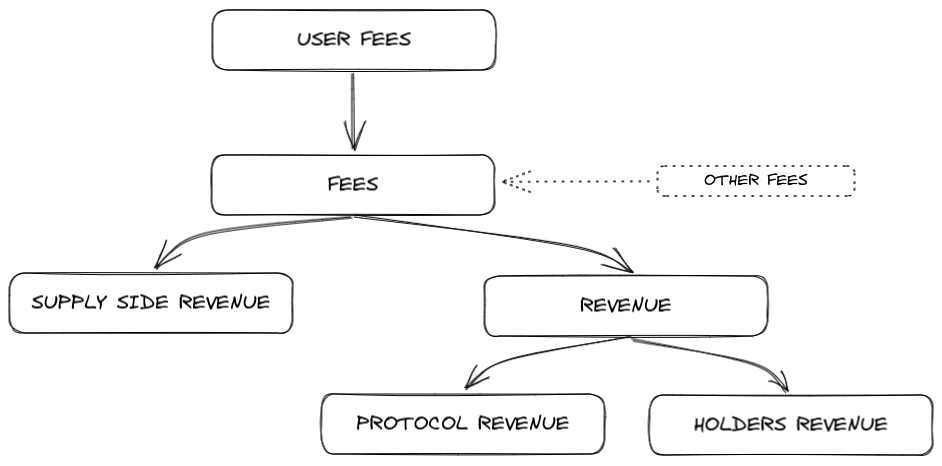

# How to write dimensions adapters

This guide will help you create adapters for DefiLlama's various dashboards, including [fees](https://defillama.com/fees), [volumes](https://defillama.com/dexs), [aggregators](https://defillama.com/aggregators), [derivatives](https://defillama.com/derivatives), [Bridge Aggregators](https://defillama.com/bridge-aggregators), [Options](https://defillama.com/options), and others.

## What is an Adapter?

An adapter is some code that:

1. Collects data on a protocol by calling some endpoints or making blockchain calls
2. Computes a response and returns it

It's a TypeScript file that exports an async function which takes a FetchOptions object containing:

* startTimestamp: Unix timestamp for start of period
* endTimestamp: Unix timestamp for end of period
* startBlock: Block number corresponding to start timestamp
* endBlock: Block number corresponding to end timestamp
* createBalances: Helper function to track token balances
* api: Helper for making contract calls
* getLogs: Helper for fetching event logs

The function returns an object with metrics (like fees, volume, etc.) for that time range.

## Introduction to Dimension Adapters

DefiLlama's dashboards track various metrics (dimensions) for DeFi protocols. Each dashboard focuses on specific dimensions:

* **Dexs dashboard**: Tracks trading volume from DEXs (spot/swaps)
* **Fees dashboard**: Tracks fees and revenue from all types of protocols
* **Aggregators dashboard**: Tracks volume from DEX aggregators
* **Derivatives dashboard**: Tracks volume from derivatives protocols
* **Aggregator-Derivatives dashboard**: Tracks volume from aggregator-derivatives protocols
* **Bridge Aggregators dashboard**: Tracks volume from bridge aggregators
* **Options dashboard**: Tracks notional and premium volume from options DEXs

## How to List Your Project

The majority of adapters for DefiLlama dashboards are contributed and maintained by their respective communities, with all changes being coordinated through the [`DefiLlama/dimension-adapters` GitHub repo](https://github.com/DefiLlama/dimension-adapters).

To add your protocol to any dashboard, follow these steps:

1. Fork the [`dimension-adapters`](https://github.com/DefiLlama/dimension-adapters) repository
2. Create a new file at `[dashboard]/yourProtocolName/index.ts` or `[dashboard]/yourProtocolName.ts` (where `[dashboard]` is the relevant folder like `fees`, `dexs`, `aggregators`, `aggregator-derivatives`, `bridge-aggregators`, `options`, etc.)
3. Implement your adapter following the guidelines in this document
4. Test your adapter using `npm test [dashboard] yourProtocolName`
5. Submit a PR! A llama will review it and merge it. Once merged, it can take up to 24h to be available in the dashboard


Seeing issues getting logs or with calls at historical blocks? You can replace the RPC being used by creating a .env file and filling it with rows like this: ETHEREUM\_RPC="https://..." BSC\_RPC="https://..." POLYGON\_RPC="https://..." ...


## Basic Example

Let's start with a simple, complete example of a fees adapter:

```typescript
import { FetchOptions, SimpleAdapter } from "../../adapters/types";
import { CHAIN } from "../../helpers/chains";

const FeeCollectedEvent = "event FeesCollected(address indexed _token, address indexed _integrator, uint256 _integratorFee, uint256 _lifiFee)"

const LIFIFeeCollector = '0xbD6C7B0d2f68c2b7805d88388319cfB6EcB50eA9';

const fetch = async (options: FetchOptions) => {
  const dailyFees = options.createBalances();
  const data: any[] = await options.getLogs({
    target: LIFIFeeCollector,
    eventAbi: FeeCollectedEvent,
  });
  data.forEach((log: any) => {
    dailyFees.add(log._token, log._integratorFee);
  });
  return { dailyFees, dailyRevenue: dailyFees, dailyProtocolRevenue: dailyFees };
};

const methodology = {
  Fees: 'All fees paid by users for swap and bridge tokens via LI.FI.',
  Revenue: 'Fees are distributed to LI.FI.',
  ProtocolRevenue: 'Fees are distributed to LI.FI.',
}

const adapter: SimpleAdapter = {
  version: 2,
  fetch,
  chains: [CHAIN.ETHEREUM],
  start: '2023-07-27',
  methodology
}

export default adapter;
```

### Adapter Structure

The object exported by your adapter file defines its behavior. The main configuration object holds a `version` key and supports two different structures:

**Recommended Structure**: For protocols with the same fetch logic across all chains, you can use the simplified structure with `fetch`, `chains`, `start`, and `methodology` at the root level.

### SimpleAdapter Properties

* **fetch**: The core async function that returns different dimensions of a protocol. The dimensions returned depend on which dashboard you're targeting (e.g., `dailyVolume` for the dexs dashboard, `dailyFees` for the fees dashboard). See "Core Dimensions" below.
* **chains**: Array of chain constants (e.g., `[CHAIN.ETHEREUM, CHAIN.POLYGON]`) indicating which chains this adapter supports.
* **start**: The earliest timestamp (as YYYY-MM-DD or unix timestamp) we can pass to the fetch function. This tells our servers how far back we can get historical data.
* **methodology**: (Optional) Object describing how different dimensions are calculated. See "Metadata and Methodology" below.
* **runAtCurrTime**: (Optional, defaults to `false`) Boolean flag. Set to `true` if the adapter can only return the latest data (e.g., last 24h) and cannot reliably use the `startTimestamp` and `endTimestamp` passed to `fetch`.

#### Example of Multi-chain Root-level Structure

```typescript
import { CHAIN } from "../../helpers/chains";

const methodology = {
  Fees: 'All fees paid by users for protocol operations.',
  Revenue: 'Fees distributed to the protocol.',
  ProtocolRevenue: 'Fees distributed to the protocol treasury.',
}

const adapter: SimpleAdapter = {
  version: 2,
  fetch,
  chains: [CHAIN.ETHEREUM, CHAIN.POLYGON, CHAIN.ARBITRUM],
  start: '2023-01-01',
  methodology
}
```

## Testing Your Adapter

Test your adapter locally before submitting a PR:

```
> npm test [dashboard] [protocolSlug]
> npm test [dashboard] [protocolSlug] [timestamp]
```

```
npm test fees katana
```

To test at specific day (unix format or yyyy-mm-dd):

```
npm test fees katana 1662110960
npm test dexs katana 2025-04-10
```

This checks if your adapter correctly returns data for the requested time period.

### Adapter Version

The top-level `version` key specifies the adapter version:

* **Version 2 (Recommended)**: `version: 2`. These adapters accept arbitrary start and end timestamps as input to `fetch`, allowing for flexible time ranges.
* **Version 1**: `version: 1`. Use this only if your `fetch` function can run for fixed time periods only (00:00 to 23:59 of a given day), typically because the underlying data source only provides daily data.

### Core Dimensions

Your `fetch` function should return an object containing properties corresponding to the metrics (dimensions) relevant to the dashboard you are targeting. All dimensions should be returned as balance objects (`Object<string>`) where keys are the token identifiers (e.g., `ethereum:0x...`) and values are the raw amounts (no decimal adjustments).

> **Minimum Requirements:** To be listed, your adapter **must** provide accurate `dailyFees` and `dailyRevenue` dimensions. Other daily dimensions like `dailyHoldersRevenue` are highly encouraged for better insights but are secondary. Cumulative `total*` dimensions are deprecated and should not be used.

Here are the standard dimensions grouped by dashboard type:

**Dexs and Dex Aggregators Dimensions:**

* `dailyVolume`: (**Required**) Trading volume for the period.

**Derivatives and Aggregators-Derivatives Dimensions:**

* `dailyVolume`: (**Required**) Perpetual trading volume for the period.
* `openInterestAtEnd`: (Optional) Open interest at the end of the period.
* `longOpenInterestAtEnd`: (Optional) Long open interest at the end of the period.
* `shortOpenInterestAtEnd`: (Optional) Short open interest at the end of the period.

**Bridge Aggregators Dimensions:**

* `dailyBridgeVolume`: (**Required**) Bridge volume for the period.

**Options Dimensions:**

* `dailyNotionalVolume`: (**Required**) Notional volume of options contracts traded/settled.
* `dailyPremiumVolume`: (**Required**) Premium volume collected/paid.
* `openInterestAtEnd`: (Optional) Open interest at the end of the period.
* `longOpenInterestAtEnd`: (Optional) Long open interest at the end of the period.
* `shortOpenInterestAtEnd`: (Optional) Short open interest at the end of the period.

**Fees Dimensions:**

* `dailyFees`: (**Required**) All fees and value collected from _all_ sources (users, LPs, yield generation, liquid staking rewards, etc.), excluding direct transaction/gas costs paid by users to the network. This represents the total value flow into the protocol's ecosystem due to its operation.
* `dailyUserFees`: (Optional, but helpful) The portion of `dailyFees` directly paid by end-users (e.g., swap fees, borrow interest, liquidation penalties, marketplace commissions paid by buyers/sellers).
* `dailyRevenue`: (**Required**) The portion of `dailyFees` kept by the protocol entity itself, distributed either to the treasury (`dailyProtocolRevenue`) or governance token holders (`dailyHoldersRevenue`).
  * `dailyRevenue = dailyProtocolRevenue + dailyHoldersRevenue`
* `dailyProtocolRevenue`: (Optional, clarifies revenue split) The portion of `dailyRevenue` allocated to the protocol's treasury or core team.
* `dailyHoldersRevenue`: (Optional, but important for protocols distributing to holders) The portion of `dailyRevenue` distributed to governance token holders (e.g., via staking rewards, buybacks, burns).
* `dailySupplySideRevenue`: (Optional, but helpful) The portion of `dailyFees` distributed to liquidity providers, lenders, or other suppliers of capital/resources essential to the protocol's function.
* `dailyBribeRevenue`: (Optional, specific use case) Governance token paid as bribe/incentive for token holder action.
* `dailyTokenTax`: (Optional, specific use case) Fees generated from a tax applied to token transfers.

**Fee/Revenue Attribution Examples by Protocol Type:**

If you are unsure how to classify fees and revenues, refer to this table or contact us at support@defillama.com or ask on Discord:

<figure><figcaption></figcaption></figure>

| Attribute         | DEXs                                        | Lending                                    | Chains                                         | NFT Marketplace                        | Derivatives                      | CDP                        | Liquid Staking                  | Yield                              | Synthetics                       |
| ----------------- | ------------------------------------------- | ------------------------------------------ | ---------------------------------------------- | -------------------------------------- | -------------------------------- | -------------------------- | ------------------------------- | ---------------------------------- | -------------------------------- |
| UserFees          | Swap fees paid by users                     | Interest paid by borrowers                 | Gas fees paid by users                         | Fees paid by users                     | Fees paid by users               | Interest paid by borrowers | % of rewards paid to protocol   | Paid management + performance fees | Fees paid by users               |
| Fees              | =UserFees                                   | =UserFees                                  | =UserFees                                      | =UserFees                              | UserFees + burn/mint fees        | =UserFees                  | Staking rewards                 | Yield                              | =UserFees                        |
| Revenue           | % of swap fees going to protocol governance | % of interest going to protocol governance | Burned coins (fees-sequencerCosts for rollups) | Marketplace revenue + creator earnings | Protocol governance revenue      | =ProtocolRevenue           | =ProtocolRevenue                | =ProtocolRevenue                   | =ProtocolRevenue                 |
| ProtocolRevenue   | % of swap fees going to treasury            | % of interest going to protocol            | \*                                             | Marketplace revenue                    | Value going to treasury          | Interest going to treasury | =UserFees                       | =UserFees                          | % of fees going to treasury      |
| HoldersRevenue    | Money going to gov token holders            | \*                                         | \*                                             | \*                                     | Value going to gov token holders | \*                         | \*                              | \*                                 | % of fees going to token holders |
| SupplySideRevenue | LPs revenue                                 | Interest paid to lenders                   | \*                                             | \*                                     | LP revenue                       | \*                         | Revenue earned by stETH holders | Yield excluding protocol fees      | LPs revenue                      |

> **Notes:**
>
> * Protocol governance includes treasury + gov token holders.
> * `Revenue = HoldersRevenue + ProtocolRevenue`.
> * Asterisk (\*) indicates typically not applicable or zero for that category.

## Implementation Steps

Building the `fetch` function is the core task. Here's a breakdown:

1. **Identify Supported Chains**: Determine which blockchains your protocol runs on by referencing the [chains.ts](https://github.com/DefiLlama/dimension-adapters/blob/master/helpers/chains.ts) file. For the recommended root-level structure, add these to the `chains` array. For chain-specific configurations, you'll need a `BaseAdapter` entry for each chain.
2. **Define Start Dates**: Find your protocol's deployment date to set the `start` property (root-level for consistent dates, or per-chain for different deployment dates). This enables proper data backfilling.
3. **Choose Data Source(s)**: Select the appropriate method(s) to retrieve the necessary data for calculating dimensions. Common approaches are detailed below.

## Data Source Examples

Choose the appropriate data source based on your protocol's architecture. The `fetch` function receives an `options` object containing helper utilities like `createBalances`, `getLogs`, `api` (for contract calls), `queryDuneSql`, etc.

### On-Chain Event Logs

Ideal for tracking specific events that generate fees or volume:

```typescript
const fetch = async ({ getLogs, createBalances }) => {
  const dailyFees = createBalances();
  const dailyRevenue = createBalances();
  
  const logs = await getLogs({
    target: "0xcf205808ed36593aa40a44f10c7f7c2f67d4a4d4",
    eventAbi: 'event Trade(address trader, address subject, bool isBuy, uint256 shareAmount, uint256 ethAmount, uint256 protocolEthAmount, uint256 subjectEthAmount, uint256 supply)'
  });
  
  logs.forEach(log => {
    dailyFees.addGasToken(log.protocolEthAmount * 2);  // Example: Total fees
    dailyRevenue.addGasToken(log.protocolEthAmount);   // Example: Protocol's share
  });
  
  return { dailyFees, dailyRevenue };
};
```

Example: [Ostium](https://github.com/DefiLlama/dimension-adapters/blob/master/fees/ostium/index.ts)

### Token Transfer Tracking

Track tokens received by protocol treasury/fee addresses:

```typescript
import { addTokensReceived } from '../../helpers/token';

const fetch = async (options: FetchOptions) => {
  // Track ERC20 token transfers to treasury
  const dailyFees = await addTokensReceived({
    options,
    tokens: ["0x4200000000000000000000000000000000000006"], // WETH on Base
    targets: ["0xbcb4a982d3c2786e69a0fdc0f0c4f2db1a04e875"] // Treasury
  });

  // Example: Assuming all received tokens are fees and revenue
  return { dailyFees, dailyRevenue: dailyFees }
}
```

Example: [Synthetix](https://github.com/DefiLlama/dimension-adapters/blob/master/fees/synthetix.ts)

### Subgraphs

Fast queries for protocols with well-maintained subgraphs:

```typescript
import { request } from "graphql-request";

const fetch = async (options: FetchOptions) => {
  const dailyVolume = options.createBalances();
  
  const query = `{
    volumeStats(where: {timestamp_gte: ${options.startTimestamp}, timestamp_lt: ${options.endTimestamp}}) {
      volumeUSD
      token
    }
  }`;
  
  const { volumeStats } = await request("https://api.thegraph.com/subgraphs/name/protocol/subgraph", query);
  
  volumeStats.forEach(stat => {
    // Assuming volumeUSD needs conversion if not directly usable
    dailyVolume.add(stat.token, stat.volumeUSD); 
  });
  
  return { dailyVolume };
};
```

Examples:

* [Curve](https://github.com/DefiLlama/dimension-adapters/blob/master/fees/curve.ts)
* [LlamaLend](https://github.com/DefiLlama/dimension-adapters/blob/master/fees/llamalend.ts)
* [TheGraph](https://github.com/DefiLlama/dimension-adapters/blob/master/fees/thegraph.ts)
* [Dackieswap](https://github.com/DefiLlama/dimension-adapters/blob/master/fees/dackieswap.ts)

### Query Engines (Dune, Flipside, Allium)

For complex queries or when direct blockchain access is too expensive:

```typescript
const fetch = async (options: FetchOptions) => {
  const dailyFees = options.createBalances();
  
  const results = await options.queryDuneSql(`
    SELECT 
      SUM(amount) as fees,
      token_address
    FROM ethereum.transactions
    WHERE to_address = '0x123...abc' -- Example fee address
      AND block_time >= FROM_UNIXTIME(${options.startTimestamp})
      AND block_time < FROM_UNIXTIME(${options.endTimestamp})
    GROUP BY token_address
  `);
  
  if (results && results.length > 0) {
    results.forEach(row => {
      dailyFees.add(row.token_address, row.fees);
    });
  }
  
  return { dailyFees };
};
```

Example: [Pumpswap](https://github.com/DefiLlama/dimension-adapters/blob/master/fees/pump-swap/index.ts)

### Contract Calls

For protocols where data is accessible through view functions or requires multiple contract interactions:

```typescript
const fetch = async (options: FetchOptions) => {
  const dailyFees = options.createBalances();
  
  // Example: Get plugin data through contract calls
  const plugins = await options.api.call({
    target: "0xd7ea36ECA1cA3E73bC262A6D05DB01E60AE4AD47", // Contract address
    abi: "address[]:getPlugins",
  });
  
  // Use multiCall for efficiency when making multiple similar calls
  const bribes = await options.api.multiCall({
    abi: "function getBribe() returns (address)",
    calls: plugins
  });
  
  // Example: Collect fee data from events emitted by bribe contracts
  for (const bribe of bribes) {
    const logs = await options.getLogs({
      target: bribe,
      eventAbi: "event Bribe__RewardNotified(address indexed rewardToken, uint256 reward)",
    });
    
    logs.forEach((log) => {
      dailyFees.add(log.rewardToken, log.reward);
    });
  }
  
  return { dailyFees };
};
```

Example: [Beradrome](https://github.com/DefiLlama/dimension-adapters/blob/master/fees/beradrome/index.ts)

## Metadata and Methodology

Always include a `methodology` object to explain how your metrics are calculated. This is crucial for transparency.

```typescript
const methodology = {
  Fees: "Describes how total fees are calculated (e.g., Users pay 0.3% on each swap).",
  Revenue: "Describes how protocol revenue is calculated (e.g., Protocol keeps 0.05% of each swap).",
  SupplySideRevenue: "Describes how revenue distributed to LPs/suppliers is calculated (e.g., LPs receive 0.25% of each swap)."
  // Add methodology for other dimensions like Volume, PremiumVolume etc. as applicable
}

const adapter: SimpleAdapter = {
  version: 2,
  fetch,
  chains: [CHAIN.ETHEREUM],
  start: '2023-01-01',
  methodology
}
```

## Breakdown Labels & Income Statement

Our adapter allow to break data multiple subparts, you may want to use breakdown labels when:

* Adapter has multiple sourcess of fees
* Adapter has multiple destinations to distribute fees

#### Add breakdown labels

```js
// instead add all fees into dailyFees
dailyFees.add('0x0000000000000000000000000000000000000000', 1e18)

// you can break fees into subparts - for Lido
dailyFees.add('0x0000000000000000000000000000000000000000', 5e17, 'Staking Rewards')
dailyFees.add('0x0000000000000000000000000000000000000000', 5e17, 'MEV Rewards')

// you can break fees into subparts - for Aave
dailyFees.add('0x0000000000000000000000000000000000000000', 6e17, 'Borrow Interest')
dailyFees.add('0x0000000000000000000000000000000000000000', 2e17, 'GHO Borrow Interest')
dailyFees.add('0x0000000000000000000000000000000000000000', 2e17, 'Liquidation Fees')

// you can break fees into subparts - for Euler
dailyFees.add('0x0000000000000000000000000000000000000000', 6e17, 'Borrow Interest')
dailyFees.add('0x0000000000000000000000000000000000000000', 2e17, 'Protocol Fees')
dailyFees.add('0x0000000000000000000000000000000000000000', 2e17, 'Curators Fees')
```

Because label is a string, you can put anything into it, please check your redefine labels and use them except your adapter has specific labels. [https://github.com/DefiLlama/dimension-adapters/blob/master/helpers/metrics.ts](https://github.com/DefiLlama/dimension-adapters/blob/master/helpers/metrics.ts)

#### Describe your labels

If you add labels to adapter, always include a `breakdownMethodology` object to explain how your labels are calculated.

```js
const breakdownMethodology = {
  Fees: {
      "Staking Rewards": "ETH validators rewards.",
      "MEV Rewards": "MEV rewards from ETH execution layer.",
  },
  Revenue: "Lido takes 10% all validators and NEV rewards.",
}

const adapter: SimpleAdapter = {
  version: 2,
  fetch,
  chains: [CHAIN.ETHEREUM],
  start: '2023-01-01',
  methodology, // explain common metrics
  breakdownMethodology, // explain breakdown labels
}
```

Example: [Lido](https://github.com/DefiLlama/dimension-adapters/blob/master/fees/lido.ts)

## Important Considerations

### Precision

Use the `BigNumber` library (available via `options.createBalances()` or direct import) for mathematical operations involving token amounts, especially when dealing with different decimals or potentially large/small numbers, to avoid JavaScript precision issues.

```typescript
import BigNumber from "bignumber.js";

// ... inside fetch function
const feesInGas = new BigNumber(graphRes["fees"]);
const ethGasPrice = await getGasPrice(timestamp); // Assuming getGasPrice helper exists
const dailyFees = options.createBalances(); // Create a Balances object

dailyFees.addGasToken(feesInGas.multipliedBy(ethGasPrice).toString()); 

return {
  dailyFees,
  dailyRevenue: dailyFees
}; 
```

## Helper Functions Reference

DeFiLlama provides numerous helper functions to simplify common tasks in adapter development. These are available either via direct import or through the `options` object passed to your `fetch` function.

### Protocol-Specific Helpers (Common Abstractions)

These helpers provide high-level abstractions for common DeFi protocol archetypes.

#### Uniswap V2/V3-like Protocols

*   **`uniV2Exports` / `getUniV2LogAdapter`**: Generates adapter configurations for Uniswap V2-style DEXes across multiple chains.

    ```typescript
    import { uniV2Exports } from '../helpers/uniswap';

    // Example for a Uniswap V2 fork on BSC
    export default uniV2Exports({
      [CHAIN.BSC]: {
        factories: ['0x123...abc'], // Factory address
        fees: {
          type: 'fixed', // Or 'variable' or 'stable'
          feesPercentage: 0.3 // Swap fee percentage
        }
      }
      // Other chains...
    });
    ```

    Examples:

    * [Nile Exchange V1](https://github.com/DefiLlama/dimension-adapters/blob/master/fees/nile-exchange-v1/index.ts) (V2-style)
    * [Hydrometer](https://github.com/DefiLlama/dimension-adapters/blob/master/fees/hydrometer/index.ts)
    * [ABCDEFX](https://github.com/DefiLlama/dimension-adapters/blob/master/dexs/abcdefx/index.ts)
*   **`uniV3Exports`**: Creates adapters for Uniswap V3-style DEXes, supporting variable fees and multiple pools.

    ```typescript
    import { uniV3Exports } from '../helpers/uniswap';

    // Example for a Uniswap V3 fork on Scroll
    export default uniV3Exports({
      [CHAIN.SCROLL]: { 
        factory: '0xAAA32926fcE6bE95ea2c51cB4Fcb60836D320C42',
        // Optional custom fee handling or additional configurations
      }
      // Other chains...
    })
    ```

    Example:

    * [2thick](https://github.com/DefiLlama/dimension-adapters/blob/master/fees/2thick.ts) (V3-style)

#### Compound V2-like Protocols

*   **`compoundV2Export`**: Creates an adapter for Compound V2-like protocols, taking config parameters and returning an object that tracks fees, revenue, and distribution among holders and suppliers.

    ```typescript
    import { compoundV2Export } from '../helpers/compound';

    // Example for a Compound V2 fork on Ethereum
    export default compoundV2Export({
      reserveFactor: 0.1, // Example: 10% of interest goes to protocol
      markets: {
        [CHAIN.ETHEREUM]: {
          comptroller: '0x123...abc', // Comptroller address
          // ... other market parameters like specific cToken addresses if needed
        }
        // Other chains...
      }
    });
    ```

    Example:

    * [Strike](https://github.com/DefiLlama/dimension-adapters/blob/master/fees/strike/index.ts)

### Token Tracking Helpers

Functions for tracking native and ERC20 token movements.

*   **`addTokensReceived`**: Tracks ERC20 token transfers received by specified addresses. Supports filtering by sender/receiver and custom token transformations. Uses indexer first, then logs.

    ```typescript
    import { addTokensReceived } from '../../helpers/token';

    const fetch: any = async (options: FetchOptions) => {
      const dailyFees = await addTokensReceived({
        options,
        tokens: ["0x4200000000000000000000000000000000000006"], // WETH on Base
        targets: ["0xbcb4a982d3c2786e69a0fdc0f0c4f2db1a04e875"] // Treasury
      })

      return { dailyFees, dailyRevenue: dailyFees }
    }
    ```

    Example:

    * [Synthetix](https://github.com/DefiLlama/dimension-adapters/blob/master/fees/synthetix.ts)
*   **`addGasTokensReceived`**: Tracks native token transfers (like ETH) received by specified multisig addresses.

    ```typescript
    import { addGasTokensReceived } from '../../helpers/token';

    const fetch = async (options: FetchOptions) => {
      const dailyFees = await addGasTokensReceived({
        options,
        multisigs: ["0x123...abc", "0x456...def"] // Treasury multisig addresses
      });
      
      return { dailyFees, dailyRevenue: dailyFees };
    }
    ```
*   **`getETHReceived`**: Tracks native token transfers on EVM chains via Allium DB queries.

    ```typescript
    import { getETHReceived } from '../../helpers/token';

    const fetch = async (options: FetchOptions) => {
      const balances = options.createBalances();
      await getETHReceived({
        options,
        balances,
        target: "0xd8dA6BF26964aF9D7eEd9e03E53415D37aA96045" // Treasury address
      });
      
      return { dailyFees: balances, dailyRevenue: balances };
    }
    ```

    [Example Implementation - DexTools](https://github.com/DefiLlama/dimension-adapters/blob/master/fees/dextools.ts)
*   **`getSolanaReceived`**: Fetches token transfers to specified Solana addresses, allows blacklisting senders/signers.

    ```typescript
    import { getSolanaReceived } from '../../helpers/token';

    const fetch = async (options: FetchOptions) => {
      const dailyFees = options.createBalances();
      await getSolanaReceived({
        options,
        balances: dailyFees,
        target: "9yMwSPk9mrXSN7yDHUuZurAh1sjbJsfpUqjZ7SvVtdco", // Treasury
        blacklists: ["3xxxx..."] // Optional senders to exclude
      });
      
      return { dailyFees, dailyRevenue: dailyFees };
    }
    ```

    Example:

    * [Axiom](https://github.com/DefiLlama/dimension-adapters/blob/master/fees/axiom.ts)

### EVM Data Helpers

Functions for querying EVM logs and indexers.

*   **`getLogs`** (Available via `options.getLogs`): Retrieves event logs based on filters (target, signature, topics).

    ```typescript
    const fetch = async (options: FetchOptions) => { // options includes getLogs
      const dailyFees = options.createBalances();
      const logs = await options.getLogs({
        target: "0xcf205808ed36593aa40a44f10c7f7c2f67d4a4d4",
        eventAbi: 'event Trade(address trader, address subject, bool isBuy, uint256 shareAmount, uint256 ethAmount, uint256 protocolEthAmount, uint256 subjectEthAmount, uint256 supply)'
      });
      
      logs.forEach(log => {
        dailyFees.addGasToken(log.protocolEthAmount);
      });
      
      return { dailyFees };
    }
    ```

    [Example Implementation - Ostium](https://github.com/DefiLlama/dimension-adapters/blob/master/fees/ostium/index.ts)
*   **`queryIndexer`**: Executes queries against DefiLlama's indexers (transfers, events, etc.).

    ```typescript
    import { queryIndexer } from '../../helpers/indexer';

    const fetch = async (options: FetchOptions) => {
      const transfers = await queryIndexer({
        chain: options.chain,
        fromTimestamp: options.startTimestamp, 
        toTimestamp: options.endTimestamp,
        type: 'Transfer', // Example: query token transfers
        filter: { to: "0x123...abc" } 
      });
      
      const dailyFees = options.createBalances();
      transfers.forEach(t => dailyFees.add(t.token, t.value));
      
      return { dailyFees };
    }
    ```

    [Example Implementation - Sudoswap V2](https://github.com/DefiLlama/dimension-adapters/blob/master/fees/sudoswap-v2.ts)

### Query Engine Helpers

Functions for querying external data platforms.

*   **`queryDuneSql`** (Available via `options.queryDuneSql`): Executes SQL queries against Dune Analytics.

    ```typescript
    const fetch = async (options: FetchOptions) => { // options includes queryDuneSql
      const dailyFees = options.createBalances();
      const results = await options.queryDuneSql(`
        SELECT SUM(fee_amount) as fees
        FROM ethereum.transactions
        WHERE to = '0x123...abc'
        AND block_time BETWEEN to_timestamp(${options.startTimestamp}) AND to_timestamp(${options.endTimestamp})`
      );
      
      if (results && results.length > 0) {
        dailyFees.addGasToken(results[0].fees);
      }
      
      return { dailyFees };
    }
    ```

    [Example Implementation - Pumpswap](https://github.com/DefiLlama/dimension-adapters/blob/master/fees/pump-swap/index.ts)
*   **`queryAllium`** (Available via `options.queryAllium`): Queries the Allium database.

    ```typescript
    const fetch = async (options: FetchOptions) => { // options includes queryAllium
      const dailyFees = options.createBalances();
      const result = await options.queryAllium(`
        SELECT SUM(value) as revenue
        FROM ethereum.transactions
        WHERE to_address = '0x123...abc'
        AND block_timestamp BETWEEN TO_TIMESTAMP_NTZ(${options.startTimestamp}) AND TO_TIMESTAMP_NTZ(${options.endTimestamp})
      `);
      
      if (result && result.length > 0) {
        dailyFees.addGasToken(result[0].revenue);
      }
      
      return { dailyFees };
    }
    ```

### Chain-Specific Helpers

Helpers tailored for specific chains or L2s.

*   **`fetchTransactionFees`** (Available via `options.fetchTransactionFees`): Retrieves total native token transaction fees burned/collected by the network.

    ```typescript
    const fetch = async (options: FetchOptions) => { // options includes fetchTransactionFees
      const dailyFees = await options.fetchTransactionFees(); 
      // Assumes network fees are protocol revenue
      return { dailyFees, dailyRevenue: dailyFees }; 
    }
    ```

### General Helpers

Utility functions for common adapter patterns.

*   **`startOfDay`** (Available via `options.startOfDay`): Converts `options.endTimestamp` to 00:00:00 UTC for data sources requiring exact day timestamps.

    ```typescript
    const fetch = async (options: FetchOptions) => {
      const startOfDayTimestamp = options.startOfDay; 
      // Use startOfDayTimestamp in API calls requiring a 00:00:00 timestamp
      // e.g., const data = await fetchAPI(`...?date=${startOfDayTimestamp}`);
      // ...
    }
    ```

### Helper Source Code Reference

You can find the full source code for these helper functions in the DefiLlama GitHub repository:

* [Token Helpers](https://github.com/DefiLlama/dimension-adapters/blob/master/helpers/token.ts) - Contains functions like addTokensReceived, getETHReceived, getSolanaReceived, etc.
* [Uniswap Helpers](https://github.com/DefiLlama/dimension-adapters/blob/master/helpers/uniswap.ts) - Contains uniV2Exports, uniV3Exports
* [Compound Helpers](https://github.com/DefiLlama/dimension-adapters/blob/master/helpers/compoundV2.ts) - Contains compoundV2Export
* [Aave Helpers](https://github.com/DefiLlama/dimension-adapters/blob/master/helpers/aave/index.ts) - Contains aaveExports

## Frequently Asked Questions

### How does DeFiLlama ensure data quality and accuracy?

**Code Review Process**: Each protocol adapter undergoes peer review by llamas through GitHub pull requests. This ensures code quality, data accuracy, and that a consistent methodology is applied to all protocols for the same metrics before any adapter goes live.

**Methodology Consistency**: We maintain a uniform methodology across all protocol adapters and chains. Whenever the methodology evolves, our team propagates the update to every relevant adapter to ensure figures remain fully comparable across protocols.

**Monitoring Systems**: We maintain internal alert systems that detect unusual data spikes, broken adapters, and anomalies across both TVL and dimension adapters (fees/revenue/volume). This allows the team to quickly identify and fix issues.

**Historical Data Integrity**: When protocols add new components (like treasury wallets, new contracts, etc.), we backfill historical data to maintain completeness and accuracy. This ensures users have access to accurate historical insights.

### How we handle data integrity and keep data organic?

**Wash Trading Detection**: We actively identify and remove wash trading volumes to prevent them from undermining legitimate trading data.

**TVL Percentage Rules**: For pools with very low fee percentages (like 0.01%) that enable wash trading, we apply minimum TVL percentage rules. Only volume from pools meeting these thresholds is counted, effectively filtering out wash trading while preserving legitimate activity.

**Chain-Specific Considerations**:

* **Solana**: Due to lower transaction fees that make wash trading more viable, we apply TVL percentage filters to major Solana DEXs while maintaining legitimate volumes
* **BSC**: During farming campaigns that create wash trading incentives for low-liquidity pairs, we remove affected pairs to maintain data integrity

### How can I report data issues or provide feedback?

You can report issues or provide feedback by sending an email to support@defillama.com

Llamas regularly review feedback and implement necessary fixes to maintain the highest data quality standards across all adapters.
