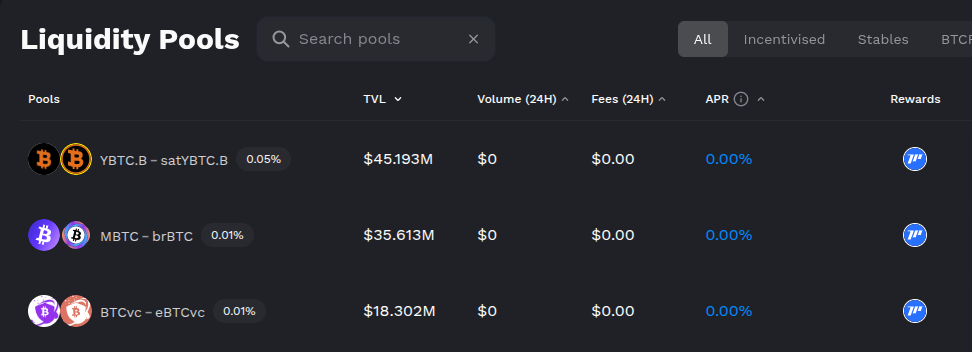

# Dimensions

In the previous page we have seen how to create the structure of our adapter. In this section we will focus on explaining the different dimensions that our adapters can return.

We call dimension to the attributes returned by the `fetch` function of our adapters. Depending on where would you like to list your project, you should return one of the below dimensions.

All dimensions should be returned as balance object (`Object<string>`) where keys are the coins and their values are the amount of each coin. Our code will get the price of each coin and calculate the final result.

Examples:

```typescript
// volume dimension in tokens object
{
    dailyVolume: {
        "ethereum:0x0000000000000000000000000000000000000000": "3924300000000"
    }
}
```

> In order to be listed your adapter would need to provide a minimum of one **daily** dimension. Providing all of them is not required but recommended in order to have better insights.

**Dexs, dexs aggregators and derivatives dimensions:**

* `dailyVolume`
* `totalVolume`

**Options dimensions**

* `dailyNotionalVolume`
* `dailyPremiumVolume`
* `totalNotionalVolume`
* `totalPremiumVolume`

**Fees dimensions**

* `dailyFees`: All fees and value collected from all sources, this also includes liquid staking rewards, generated yields and possible mint and burn fees paid by LP (but not transaction or gas fees).
* `dailyUserFees`: Fees paid by protocol users excluding gas fees. This includes swap fees to open/close positions, borrow fees and all fees user has to pay.
* `dailyRevenue`: Revenue that the protocol keeps for itself (usually either goes to the treasury, the developers or to tokenholders as in veCRV), this includes treasury and gov token holders (`dailyHoldersRevenue + dailyProtocolRevenue`)
* `dailyProtocolRevenue`: Treasury revenue.
* `dailyHoldersRevenue`: Value going to gov token holders, this includes burned coins.
* `dailySupplySideRevenue`: Value earned by liquidity providers.
* `totalFees` (Cumulative value of dailyFees)
* `totalUserFees` (Cumulative dailyUserFees)
* `totalRevenue` (Cumulative value of dailyRevenue)
* `totalProtocolRevenue` (Cumulative value of dailyProtocolRevenue)
* `totalSupplySideRevenue` (Cumulative value of dailySupplySideRevenue)
* `totalDailyHoldersRevenue` (Cumulative value of dailyHoldersRevenue)

If you are not sure how to fit the different fees and revenues generated in your protocol, take a look at the following table or ping us on Discord!

<figure><figcaption></figcaption></figure>

| Attribute         | DEXs                                        | Lending                                    | Chains                                         | NFT Marketplace                        | Derivatives                      | CDP                        | Liquid Staking                  | Yield                              | Synthetics                       |
| ----------------- | ------------------------------------------- | ------------------------------------------ | ---------------------------------------------- | -------------------------------------- | -------------------------------- | -------------------------- | ------------------------------- | ---------------------------------- | -------------------------------- |
| UserFees          | Swap fees paid by users                     | Interest paid by borrowers                 | Gas fees paid by users                         | Fees paid by users                     | Fees paid by users               | Interest paid by borrowers | % of rewards paid to protocol   | Paid management + performance fees | Fees paid by users               |
| Fees              | =UserFees                                   | =UserFees                                  | =UserFees                                      | =UserFees                              | UserFees + burn/mint fees        | =UserFees                  | Staking rewards                 | Yield                              | =UserFees                        |
| Revenue           | % of swap fees going to protocol governance | % of interest going to protocol governance | Burned coins (fees-sequencerCosts for rollups) | Marketplace revenue + creator earnings | Protocol governance revenue      | =ProtocolRevenue           | =ProtocolRevenue                | =ProtocolRevenue                   | =ProtocolRevenue                 |
| ProtocolRevenue   | % of swap fees going to treasury            | % of interest going to protocol            | \*                                             | Marketplace revenue                    | Value going to treasury          | Interest going to treasury | =UserFees                       | =UserFees                          | % of fees going to treasury      |
| HoldersRevenue    | Money going to gov token holders            | \*                                         | \*                                             | \*                                     | Value going to gov token holders | \*                         | \*                              | \*                                 | % of fees going to token holders |
| SupplySideRevenue | LPs revenue                                 | Interest paid to lenders                   | \*                                             | \*                                     | LP revenue                       | \*                         | Revenue earned by stETH holders | Yield excluding protocol fees      | LPs revenue                      |

> Some notes:
>
> * Protocol governance includes treasury + gov token holders
> * Revenue = HoldersRevenue + ProtocolRevenue
