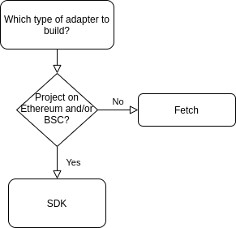

# Introduction

The majority of adapters on DefiLlama are contributed and maintained by their respective communities, with all changes being coordinated through the [DefiLlama/DefiLlama-Adapters](https://github.com/DefiLlama/DefiLlama-Adapters) github repo.

If you'd like to update one of the current adapters you can just fork the repository, modify the adapter and submit a PR. If you want to add a new one, the following guide explains the process:

## How to build an adapter

And adapter is just some code that:

1. Collects data on a protocol by calling some endpoints or making some blockchain calls
2. Computes the TVL of a protocol and returns it

#### Types of adapters

Right now there's two types of adapters co-existing within the repository:

* Fetch adapters: These calculate the TVL directly and just export a `fetch` method
* SDK adapters: These use the SDK and return all the assets locked along with their balances

The reason behind this diversity is that, initially, we just used fetch adapters, but, because these adapters only allow us to get the TVL at the current time, it was impossible for us to fill old values on a protocol's TVL chart or recompute them, thus leading to charts that looked jumpy. To solve this we introduced the new adapters, which allow us to retrieve a protocol's TVL at any point in time.

Because of this, all the adapters that were developed before the introduction of our SDK are fetch adapters, even though in most of these cases it would be better to have a SDK adapter instead.


Our SDK is fully compatible with DefiPulse's, so the adapters developed for defillama can also be directly submitted to DeFiPulse, no need repeat the same work!


#### Which adapter type should I develop?

Right now our SDK only supports EVM chains, so if your project is in any of these chains you should develop a SDK-based adapter, while if your project is on another chain a fetch adapter is the way to go.

### Next steps

You probably need to write an SDK adapter, for which you could use the following guide:


[how-to-write-an-sdk-adapter](how-to-write-an-sdk-adapter/)


Otherwise you could also try to speedrun it by just taking a look at some examples of adapters and trying to go from there. If that's more your style, check out the following page:


[speedrun.md](speedrun.md)

